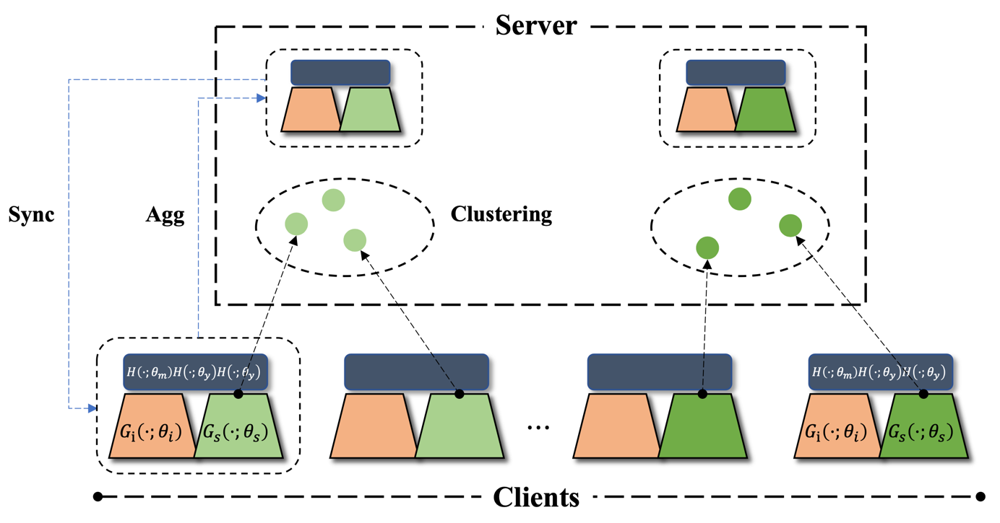

# RCFL
This is the official repository of paper **Robust Clustered Federated Learning**.

## Dependencies
- torch 1.8.1
- torchvision 0.9.1
- scikit-learn 0.24.2
- numpy 1.19.5
- wandb 0.10.32

Install all dependencies using
```
pip install -r requirements.txt
```

## Quick Start
For quick start, you could run the scripts to reproduce the reported results.

#### 
```bash
python {algorithm}_run.py 
                    --algorithm {algorithm} 
                    --dataset {dataset} 
                    --model {model} 
                    --communicationRounds 100 
                    --batchSize 50 
                    --wandb 1 
                    --lr 0.01 
                    --lrDecay 0.99 
                    --decayStep 1 
                    --optimizer adam 
                    --K {K} 
                    --seed 24 
                    --classifyingEpoch 5
```

## Arguments
```
--algorithm             str         Algorithm.                      Default is 'fedavg', supports ['standalone', 'fedavg', 'fedprox', 'ifca', 'clusteredfl', 'fesem', 'per_fedavg', 'fedrep', 'fedper', 'ditto', 'rcfl'].
--dataset               str         Dataset.                        Default is 'digit5', supports ['digit5', 'pacs', 'home'].
--model                 str         Model.                          Default is 'SimpleDigit5CNNModel', supports ['SimpleDigit5CNNModel', 'SimplePACSCNNModel', 'SimpleHomeCNNModel', 'Digit5CNNModel', 'PACSCNNModel', 'HomeCNNModel']
--K                     int         Number of clusters.             Default is 5. 
--seeds                 int         Randoms seed.                   Default is 24.
```
